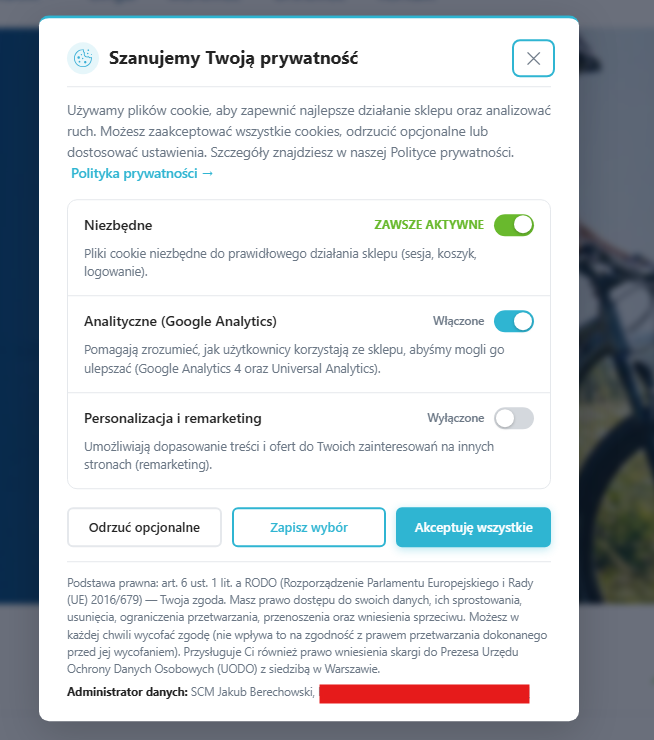

# scm_cookieconsent — GDPR / RODO Cookie Consent

A professional cookie consent module for PrestaShop **1.7 / 8.x / 9.x** — compliant with the **GDPR** (Regulation 2016/679), Polish **UODO** guidelines and **Google Consent Mode v2**.



## Key features

| Status | Feature |
| --- | --- |
| ✅ | Granular consent per category (Essential, Analytics, Marketing, custom) |
| ✅ | **Multilanguage out of the box: Polish, English, German, French** (other shop languages fall back to English); every text editable per language from the admin panel |
| ✅ | Google Consent Mode v2 — `consent default` before any tags load, `consent update` after the user's choice |
| ✅ | Automatic tag injection: **Google Tag Manager**, **Google Analytics 4**, **Google Ads** (gtag.js) — gated by Consent Mode |
| ✅ | **Meta Pixel** loaded only after marketing consent (`ad_storage=granted`) — zero requests to Meta before consent; `fbq consent grant/revoke` |
| ✅ | `scm_consent_update` dataLayer event after every consent change — ready-made GTM trigger |
| ✅ | Three banner positions: bottom bar, centered modal, bottom-left panel |
| ✅ | Active cookie removal on rejection (wildcard `*` support) |
| ✅ | Configurable consent lifetime (default 365 days), JSON `scm_consent` cookie with `SameSite=Lax` |
| ✅ | Reopen widget + "change settings later" link |
| ✅ | No pre-checked optional toggles (GDPR art. 4(11) compliant) |
| ✅ | Editable brand colors (HEX) with live preview |
| ✅ | Legal footer with GDPR art. 6(1)(a) legal basis, data subject rights and the right to lodge a complaint |
| ✅ | Full accessibility: `role="dialog"`, `role="switch"`, focus trap, ESC, `focus-visible` |
| ✅ | Zero JS dependencies (~7 kB), ES5, works in IE 11+ |
| ✅ | `prefers-reduced-motion` respected |

## Languages

Default texts and default cookie categories ship in **Polish, English, German and French**. The module picks the right language automatically:

- **Banner texts** are stored per shop language (`Configuration` multilang values). Each installed language gets the bundled translation for its ISO code; any other language receives the English fallback. All texts are editable per language in the **Texts** tab.
- **Cookie categories** store their name and description per language (`scm_cookie_categories_lang` table). The CRUD form in the **Cookie categories** tab shows one field per installed language; empty translations inherit the default-language value.
- The front-office banner always renders in the visitor's current shop language.

## Admin panel (7 tabs)

1. **Settings** — data controller (name, address, e-mail), privacy policy URL, consent lifetime, banner position, reopen widget visibility
2. **Texts** — title, intro, all button labels, toggle labels and the legal footer — each editable per language
3. **Cookie categories** — full CRUD with per-language name/description: add, edit, enable/disable, delete (required categories are protected)
4. **Integrations** — GTM / GA4 / Google Ads / Meta Pixel IDs with format validation and configuration status; the module injects the tags itself in the correct order
5. **Consent Mode v2** — enable switch, `wait_for_update`, `url_passthrough`, `ads_data_redaction`, `security_storage`, regional scoping, signal map
6. **Appearance** — brand colors (primary + accent) with instant preview
7. **GDPR help** — compliance checklists, key legal bases, links to UODO, EUR-Lex, EDPB

## Requirements

| | |
| --- | --- |
| PrestaShop | 1.7.0+, 8.x, 9.x |
| PHP | 7.1+ (8.1 – 8.4 on PrestaShop 9) |
| Theme | any theme exposing the standard `displayHeader` and `displayBeforeBodyClosingTag` hooks (Classic, Hummingbird, most commercial themes) |

Front-office assets are loaded through the modern `registerStylesheet` / `registerJavascript` API with an automatic fallback to legacy `addCSS` / `addJS` on older installations.

## Installation

1. Copy the `scm_cookieconsent/` directory into `<prestashop_root>/modules/`
2. In the PrestaShop back office: **Modules → Module Manager** → search for *SCM Cookie Consent* → **Install**
3. Click **Configure** and fill in the data controller details and the privacy policy URL

## Default categories

| Name | Required | Consent Mode | Patterns |
| --- | --- | --- | --- |
| Essential | Yes | `security_storage` | `PrestaShop-*`, `PHPSESSID`, `id_cart`, `ps_*` |
| Functional | No | `functionality_storage` | `currency`, `language`, `viewed_products` |
| Analytics (Google Analytics) | No | `analytics_storage` | `_ga`, `_ga_*`, `_gid`, `_gat` |
| Marketing (Google Ads, Meta, TikTok) | No | `ad_storage,ad_user_data,ad_personalization` | `_fbp`, `_gcl_*`, `_gac_*`, `fr` |
| Personalisation and remarketing | No | `personalization_storage` | `personalization_id`, `test_cookie` |

## Google Consent Mode v2

The module automatically calls:

```js
gtag('consent', 'default', { analytics_storage: 'denied', ad_storage: 'denied', ... });  // before the choice
gtag('consent', 'update',  { analytics_storage: 'granted', ... });                       // after the choice
```

**Important:** if you enter IDs in the **Integrations** tab, the module injects the tags itself directly **after** the `default` signal — do not add the same tags manually. **GTM is the preferred path**: when a GTM container is configured (your own or from an external marketing module), direct `gtag.js` (GA4/Ads) is NOT loaded — configure GA4/Ads tags inside the GTM container instead. Direct `gtag.js` works only as a fallback when no GTM container exists.

Supported Consent Mode signals: `analytics_storage`, `ad_storage`, `ad_user_data`, `ad_personalization`, `functionality_storage`, `personalization_storage`, `security_storage`.

## Working with external marketing modules (GTM / TagConcierge / PS Marketing with Google)

If another module already injects Google tags (e.g. **TagConcierge GTM**, **PS Marketing with Google**, Google Analytics modules), this module automatically:

1. **Does not load a second container** — it detects active marketing modules (and an existing `gtm.js`/`gtag.js` script in the DOM) and skips its own GTM/GA4/Ads injection; a warning is shown in the admin panel.
2. **Places itself first in the `displayHeader` hook** — the `consent default` signal is emitted before the external module's GTM snippet.
3. **For returning visitors it sends `consent update` already in `<head>`** — `update` takes precedence over any later external `consent default`, so the saved choice is never overwritten.

The external module's tags are still governed by this module's Consent Mode v2 (default + update), and the `scm_consent_update` event can be used as a GTM trigger.

## Meta Pixel integration

The `fbevents.js` script is **not loaded** until the user accepts the marketing category (`ad_storage` signal) — no request reaches Meta's servers before consent (UODO / EDPB Guidelines 5/2020 requirement). After consent the pixel starts immediately (no page reload): `fbq('consent', 'grant')` → `init` → `PageView`. After consent withdrawal `fbq('consent', 'revoke')` is called and the `_fbp` / `_fbc` cookies are actively removed.

After every consent change the module publishes a `dataLayer` event:

```js
{ event: 'scm_consent_update', scm_consent: { analytics_storage: 'granted', ad_storage: 'denied', ... } }
```

— use it in GTM as a trigger for consent-dependent tags.

## Configuration keys (`Configuration`)

| Key | Default value |
| --- | --- |
| `SCM_COOKIE_COMPANY_NAME` | shop name from PrestaShop |
| `SCM_COOKIE_COMPANY_ADDRESS` | *(empty)* |
| `SCM_COOKIE_COMPANY_EMAIL` | shop e-mail from PrestaShop |
| `SCM_COOKIE_PRIVACY_URL` | *(empty)* |
| `SCM_COOKIE_EXPIRY_DAYS` | `365` |
| `SCM_COOKIE_POSITION` | `bottom` |
| `SCM_COOKIE_SHOW_REOPEN` | `1` |
| `SCM_COOKIE_COLOR_PRIMARY` | `#2fb5d2` |
| `SCM_COOKIE_COLOR_ACCENT` | `#69b92d` |
| `SCM_COOKIE_GTM_ID` | *(empty — GTM disabled)* |
| `SCM_COOKIE_GA4_ID` | *(empty — GA4 disabled)* |
| `SCM_COOKIE_ADS_ID` | *(empty — Google Ads disabled)* |
| `SCM_COOKIE_META_PIXEL_ID` | *(empty — Meta Pixel disabled)* |
| `SCM_COOKIE_GCM_*` | Consent Mode v2 settings (`GCM_ENABLED=1`, `GCM_WAIT_MS=500`, …) |
| `SCM_COOKIE_TXT_*` | banner texts, stored **per language** (PL/EN/DE/FR defaults) |

## File structure

```text
scm_cookieconsent/
├── scm_cookieconsent.php
├── views/
│   ├── css/
│   │   ├── scm_cookieconsent.css      — banner styles (front)
│   │   └── admin.css                  — admin panel styles
│   ├── js/
│   │   ├── scm_cookieconsent.js       — IIFE logic (SOURCE — edit here)
│   │   ├── scm_cookieconsent.min.js   — build loaded on the front
│   │   └── src/gcm_bootstrap.src.js   — source of the inline bootstrap in gcm_bootstrap.tpl
│   └── templates/
│       ├── admin/configure.tpl        — configuration page
│       └── hook/
│           ├── cookie_banner.tpl      — banner template
│           └── gcm_bootstrap.tpl      — Consent Mode v2 bootstrap (minified)
├── LICENSE
└── README.md
```

The front office only receives minified code. After changing the sources, rebuild:

```bash
npx terser views/js/scm_cookieconsent.js -c -m -o views/js/scm_cookieconsent.min.js
npx terser views/js/src/gcm_bootstrap.src.js -c -m   # paste the result into {literal} in gcm_bootstrap.tpl
```

## Database

| Table | Purpose |
| --- | --- |
| `scm_cookie_categories` | cookie categories (base data + default-language name/description) |
| `scm_cookie_categories_lang` | per-language category name/description |

## Hooks

| Hook | Purpose |
| --- | --- |
| `displayHeader` | CSS + JS loading, Consent Mode v2 bootstrap |
| `displayBeforeBodyClosingTag` | banner rendering + inline configuration |

## Disclaimer

This module is a technical tool that supports GDPR compliance, but it does not replace legal advice. Consult your privacy policy and record of processing activities with a lawyer or DPO.

## License

**SecCodeSmith Commercial License v1.1** — © 2026 SCM Jakub Berechowski

| User type | Terms |
| --- | --- |
| Individuals, non-commercial projects | Free |
| Small and medium businesses (< 500 employees and < €50M revenue) | Free |
| Enterprises (≥ 500 employees or ≥ €50M revenue) | Commercial license required |

To purchase an Enterprise license, contact: [admin@seccodesmith.pl](mailto:admin@seccodesmith.pl)

Full license text: [LICENSE](LICENSE)
